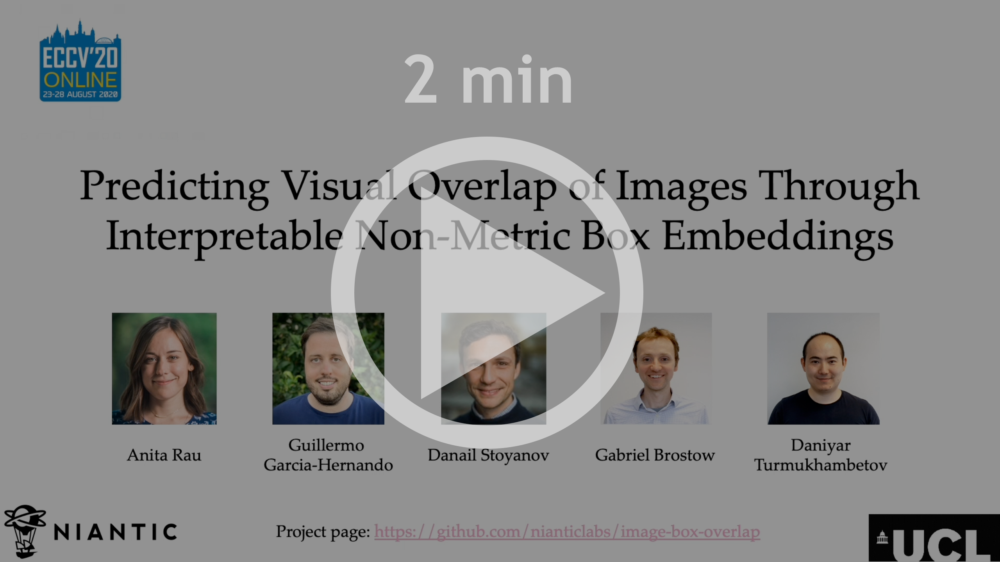
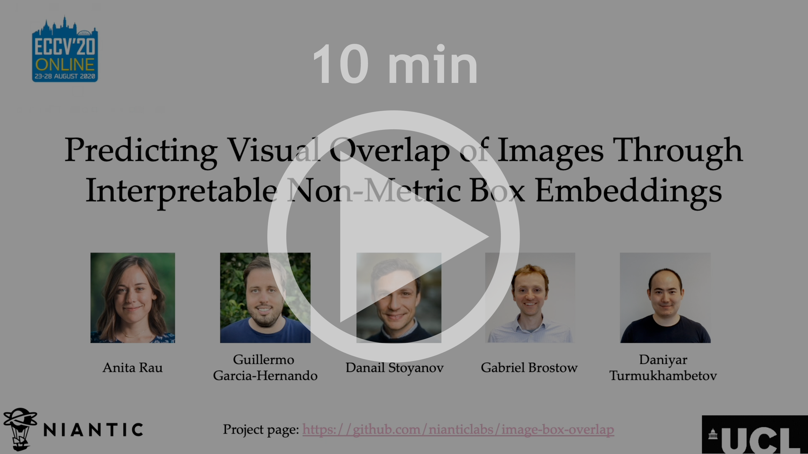
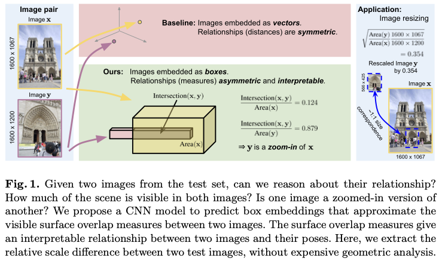
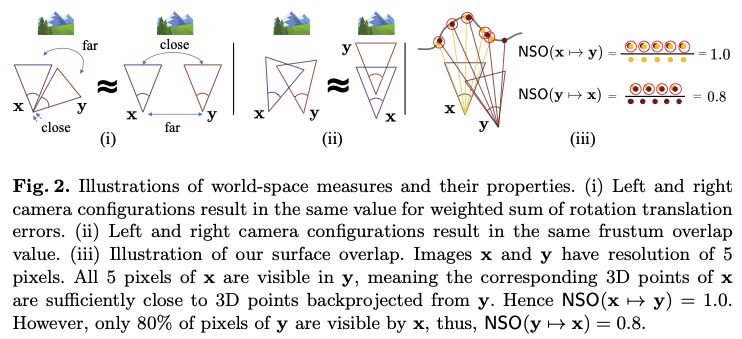
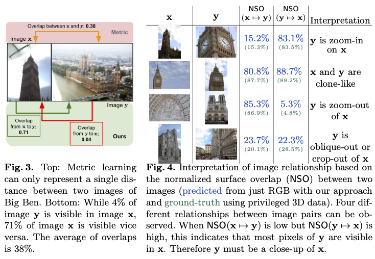
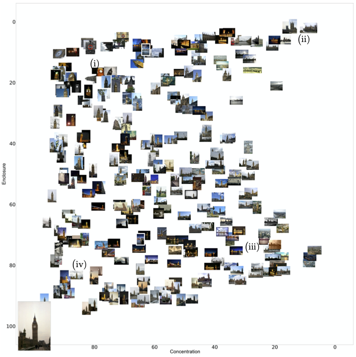
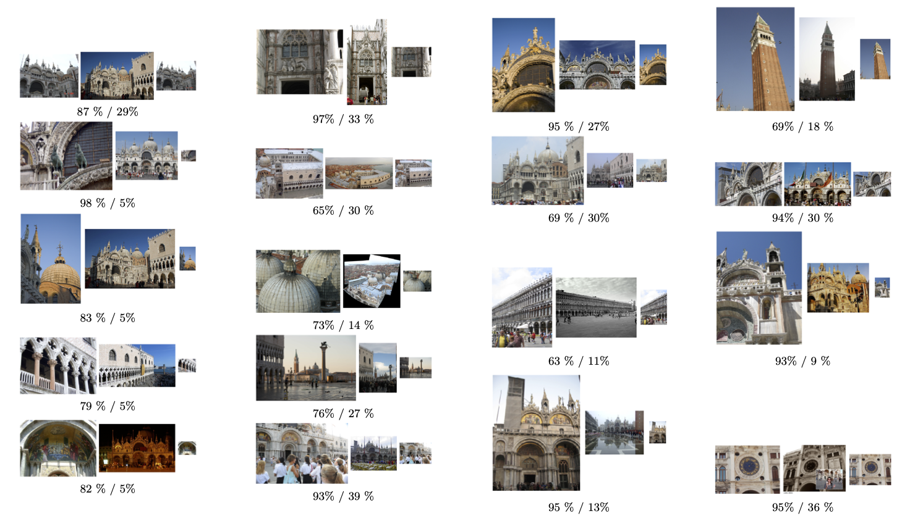

# [Predicting Visual Overlap of Images Through Interpretable Non-Metric Box Embeddings](https://arxiv.org/abs/2008.05785)

**[Anita Rau](https://www.ucl.ac.uk/surgical-robot-vision/anita-rau), [Guillermo Garcia-Hernando](https://guiggh.github.io/), [Danail Stoyanov](https://scholar.google.co.uk/citations?user=pGfEK6UAAAAJ&hl=en), [Gabriel J. Brostow](http://www0.cs.ucl.ac.uk/staff/g.brostow/) and [Daniyar Turmukhambetov](http://dantkz.github.io/about)  – ECCV 2020 (Spotlight presentation)**


[Link to paper](https://arxiv.org/abs/2008.05785)  

<p align="center">
  <a href="https://storage.googleapis.com/niantic-lon-static/research/image-box-overlap/short-video.mp4">
  
  </a>
</p>


<p align="center">
  <a href="https://storage.googleapis.com/niantic-lon-static/research/image-box-overlap/long-video.mp4">
  
  </a>
</p>


**Code and supplementary pdf are coming soon...**


<p align="center">
  
</p>

To what extent are two images picturing the same 3D surfaces? Even when this is a known scene, the answer typically
requires an expensive search across scale space, with matching and geometric verification of large sets of
local features. This expense is further multiplied when a query image is evaluated against
a gallery, e.g. in visual relocalization. While we don’t obviate the need for geometric
verification, we propose an interpretable image-embedding that cuts the search in scale space to essentially a lookup.

Neural networks can be trained to predict a vector representations for images, such that the relative camera position between
pairs of images is approximated by a distance in vector space. And there are a few versions of such relations, that 
unfortunately are not interpretable.
<p align="center">
  
</p>


We propose to capture camera position relations through normalized surface overlap (NSO). 
NSO measure is not symmetric, but it is interpretable.
<p align="center">
  
</p>

We propose to represent images as boxes, not vectors. Two boxes can intersect, and boxes can have different volumes.
The ratio of intersection over volume can be used to approximate normalized surface overlap. So, box representation
allows us to model non-symmetric (non-metric) relations between pairs of images. The result is that with box embeddings
we can quickly identify, for example, which test image is a close-up version of another.

Next we plot the predicted NSO relationship between a test query image and a set of test images. We say "enclosure" for NSO of query pixels visible in the retrieved image, and concentration for NSO of retrieved image pixels visible in the query image.
<p align="center">
  
</p>
In the figure above, we show a query image from the test set (lower left corner) and the concentration and enclosure between randomly sampled test images from the same scene. The query image shows Big Ben from the view of the Westminster Bridge. (i) It can be observed that close-ups on the tower clock are clustered around the coordinates (80, 15). (ii) The images in the upper right corner show the waterfront side of Westminster Palace. These are crop-outs of the query image. In fact, the tower in the lower left corner of the query is one of the two towers that mark the corners of the water-front side of the palace. The retrievals in the upper right quadrant of the cluster therefore extends the view of the query. (iii) The images in the lower right area of the cluster clearly show zoom outs, with the pointy bell tower visible in all images. (iv) Lastly, one can observe that the images in the clone-like category are in fact similar views on Big Ben.


Finally, the predicted normalized surface overlap can be used to derive relative scale factor between a pair of images.

<p align="center">
  
</p>
Figure above illustrates several examples of how our method can estimate geometric relationships between images. For each pair the enclosure and concentration are calculated from which the relative estimated scaled can be derived. Based on that scale, the first image is resized and shown in the third position. The resized images match the scale of the scene in the first image to the scale in the second image. The two numbers below each image pair show the estimated enclosure and concentration. Note that although some scale estimates are inaccurate, overwhelmingly the rescaling does not increase the scale difference between the two images, but only reduces it.

Subsequently, local features need only be detected at that scale. We validate our scene-specific
model by showing how this embedding yields competitive image-matching results, while being simpler, faster,
and also interpretable by humans.


## ✏️ 📄 Citation

If you find our work useful or interesting, please consider citing [our paper](https://arxiv.org/abs/2008.05785):

```
@inproceedings{rau-2020-image-box-overlap,
 title   = {Predicting Visual Overlap of Images Through Interpretable Non-Metric Box Embeddings},
 author  = {Anita Rau and
            Guillermo Garcia-Hernando and
            Danail Stoyanov and
            Gabriel J. Brostow and
            Daniyar Turmukhambetov
           },
 booktitle = {European Conference on Computer Vision ({ECCV})},
 year = {2020}
}
```


# 👩‍⚖️ License
Copyright © Niantic, Inc. 2020. Patent Pending. All rights reserved. Please see the license file for terms.
